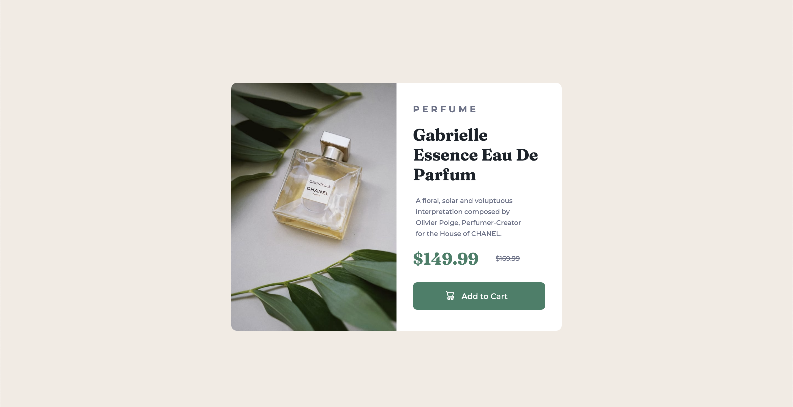

# Frontend Mentor - Product preview card component solution

This is a solution to the [Product preview card component challenge on Frontend Mentor](https://www.frontendmentor.io/challenges/product-preview-card-component-GO7UmttRfa). Frontend Mentor challenges help you improve your coding skills by building realistic projects. 

## Table of contents

- [Overview](#overview)
  - [The challenge](#the-challenge)
  - [Screenshot](#screenshot)
  - [Links](#links)
- [My process](#my-process)
  - [Built with](#built-with)
  - [What I learned](#what-i-learned)
- [Author](#author)
- [Acknowledgments](#acknowledgments)

## Overview

### The challenge

Users should be able to:

- View the optimal layout depending on their device's screen size
- See hover and focus states for interactive elements

### Screenshot



### Links

- Solution URL: [Add solution URL here](https://github.com/mlcundayag/product-preview)
- Live Site URL: [Add live site URL here](https://mlcundayag.github.io/product-preview/)

## My process

### Built with

- Semantic HTML5 markup
- CSS custom properties
- CSS Grid
- Mobile-first workflow

### What I learned

I learned using grid and background image styling. 

To see how you can add code snippets, see below:

```html
<div class="text-content">
      <div class="text-heading">
        <h2>Perfume</h2>
        <h1>Gabrielle Essence Eau De Parfum</h1>
      </div>
      <div class="description">
        <p>A floral, solar and voluptuous interpretation composed by Olivier Polge,
          Perfumer-Creator for the House of CHANEL.</p>
      </div>
      <div class="text-value">
        <p class="product-price">$149.99</p>
          <p class="compare-price">$169.99</p>
        </p>
      </div>
      <button>
        <a href="#">
          <div class="button-group">
            
            <p>Add to Cart</p>
          </div>
        </a>
      </button>
    </div>
```
```css
.image-content {
    height: 239px;
    border-radius: 10px 10px 0px 0px;
    background-image: url("../images/image-product-mobile.jpg");
    background-position: top center;
    background-repeat: no-repeat;
    background-size: cover;
}
```

## Author

- GitHub - [mlcundayag](https://github.com/mlcundayag)
- Frontend Mentor - [@mlcundayag](https://www.frontendmentor.io/profile/mlcundayag)


## Acknowledgments

- [UX Planet](https://uxplanet.org/challenge-006-product-preview-card-component-2de1d66fb4f6) - This helped me for understand how to use image background as well as grid. The explanation on how to get to the optimized solutionn will help me complete further challenges. 


